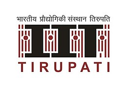

# EE532L Deep Learning for Healthcare - Programming Assignment 03

## Report (pa03_a.py)
Accuracy: 

Methods used to improve accuracy:

Bonus question:

 -Results and Observations:

## Report (pa03_b.ipynb)
Accuracy: 

Methods used to improve accuracy:

Bonus question:
 -Results and Observations:

## About (pa03_a.py)
The Pima Indians Diabetes Database is a widely used dataset in machine learning, particularly for binary classification tasks related to diabetes prediction. The dataset consists of 768 instances. There are 8 numeric predictive attributes. The attributes are as follows:
 - Pregnancies: Number of times pregnant
 - Glucose: Plasma glucose concentration 2 hours in an oral glucose tolerance test
 - BloodPressure: Diastolic blood pressure (mm Hg)
 - SkinThickness: Triceps skin fold thickness (mm)
 - Insulin: 2-Hour serum insulin (mu U/ml)
 - BMI: Body mass index (weight in kg/(height in m)^2)
 - DiabetesPedigreeFunction: Diabetes pedigree function (a function which scores the likelihood of diabetes based on family history)
 - Age: Age in years

The target variable is a binary variable indicating whether a patient has diabetes or not. It takes the values 0 (no diabetes) or 1 (diabetes). Now your goal is to build a feed forward neural network from scratch, which includes 8 input neurons and 1 hidden layer with 3 neurons, to accurately classify individuals as diabetic or non-diabetic based on the given attributes.

## About (pa03_b.ipynb)
The PneumoniaMNIST consists of 5,856 pediatric chest X-Ray images. The task is binary-class classification of pneumonia against normal. The #Training/ Validation/Test is 4,708/524/624. Image size is 1 × 28 × 28.

The target variable is a binary variable indicating whether a patient has pneumonia or not. Now your goal is to build a feed forward neural network using tensorflow to accurately classify.

## Instructions
  - Make sure you have a GitHub account. If you don't have one, create an account at [GitHub](https://github.com/).
  - Please accept this invite (shared in the Google Classroom) for the GitHub Classroom.
  - Once you accept the assignment invitation, you will be redirected to your assignment repository on GitHub.
  - You're supposed to only change the sections where you are allowed to do so in the pa03_a.py script.
  - Then upload or commit and push the changes to your assignment repo.
  - Your assignment will be automatically graded, otherwise, you will receive an email that the auto-grading has failed then make sure the code has no errors.

## References
- Smith, J.W., Everhart, J.E., Dickson, W.C., Knowler, W.C., & Johannes, R.S. (1988). Using the ADAP learning algorithm to forecast the onset of diabetes mellitus. In Proceedings of the Symposium on Computer Applications and Medical Care (pp. 261--265). IEEE Computer Society Press.
- Yang, Jiancheng, et al. "Medmnist v2-a large-scale lightweight benchmark for 2d and 3d biomedical image classification." Scientific Data 10.1 (2023): 41.

## License and Acknowledgement
The dataset is from [Kaggle](https://www.kaggle.com/datasets/uciml/pima-indians-diabetes-database/data?select=diabetes.csv) and [MedMNIST](https://medmnist.com/). Please follow their licenses. Thanks for their awesome work.

